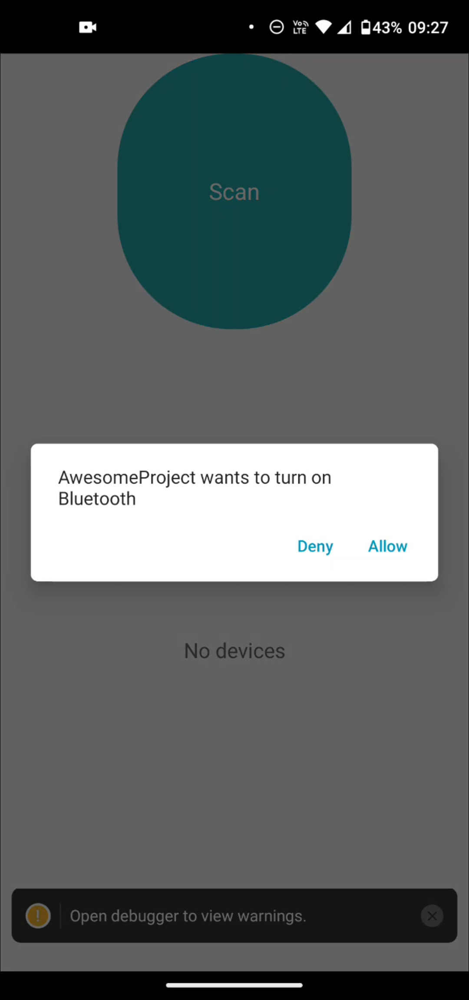
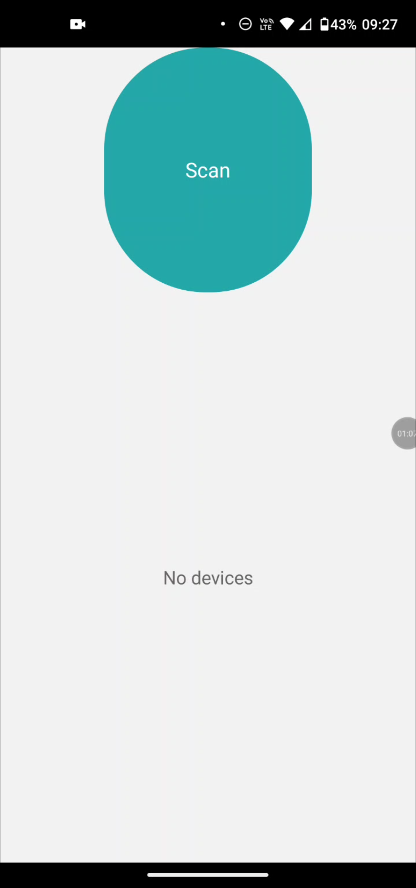

# 📱 BLE Scanner App

This application is able to scan BLE (Bluetooth Low Energy) devices, show what services the devices have and connect to them.

---

## 🚀 How to Run the Project

### 1. Install dependencies
npm install

### 2. Start the Metro server
npm start

### 3. Build the project on a physical device or emulator
npm run android

